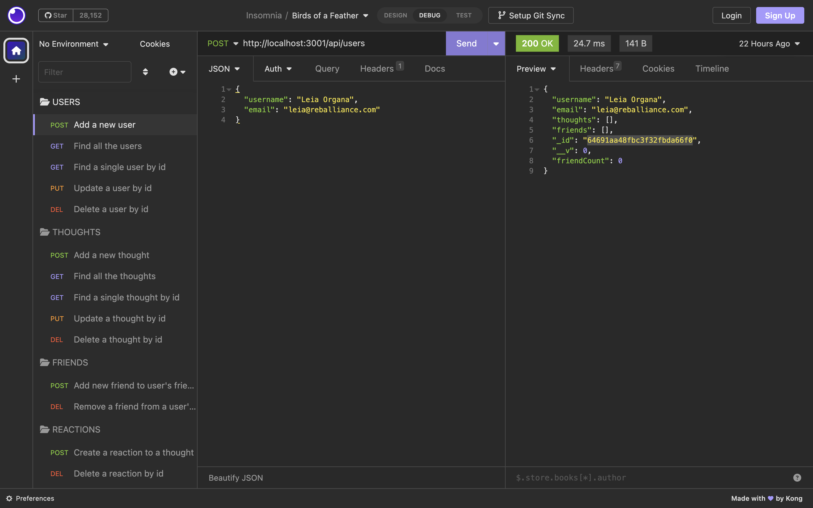
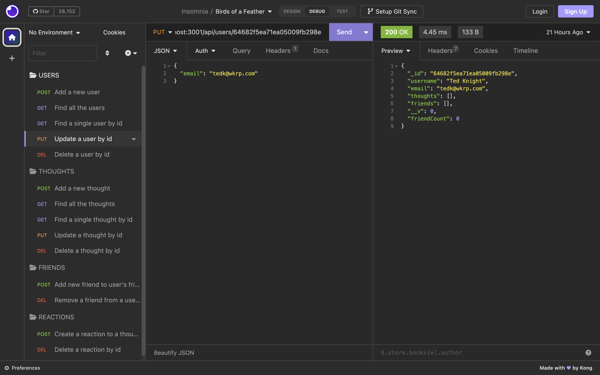
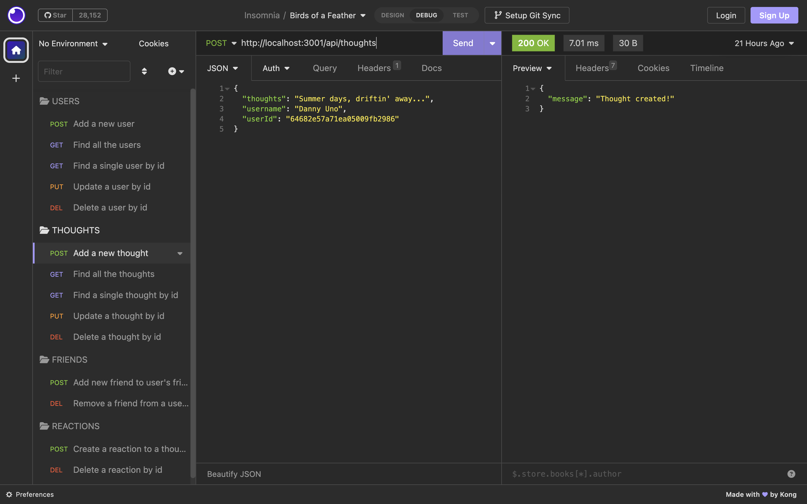
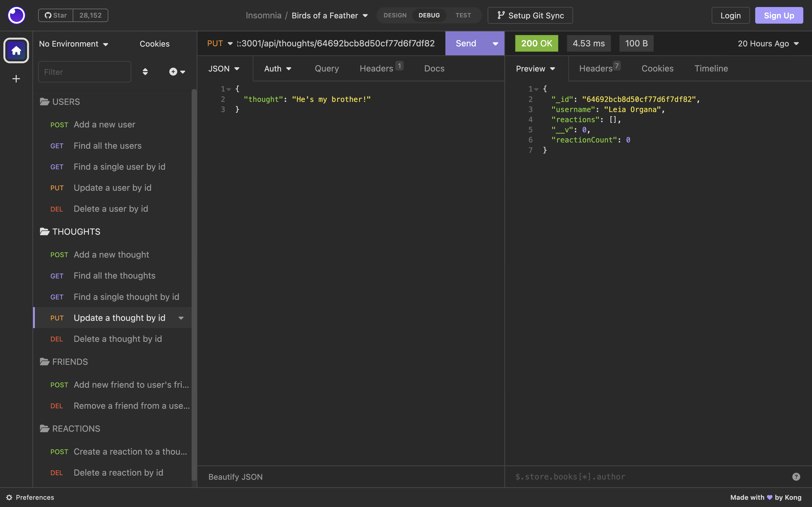
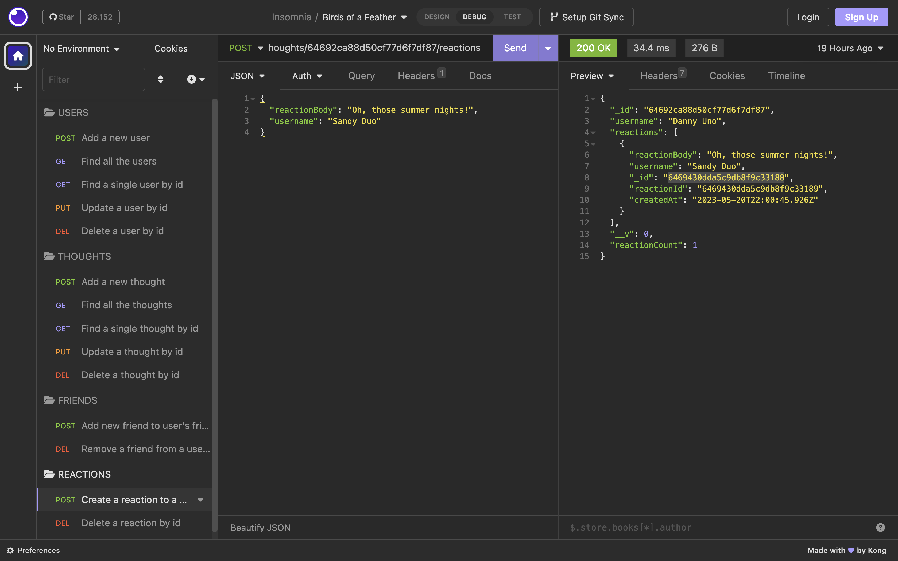

# birds-of-a-feather

## Description

This project creates an API for potential use in a social network.  The database is created in MongoDB, Express.js is used for routing, and Mongoose as the Object Data Modeling library.

The application creates the foundation for routing and storing information in a database that links a user to their posts (in this case, thoughts), to their friends (other users), and linking comments by other users to the thoughts.  The goal is to create an environment where the users can share their thoughts and comments with their friends.

Through this project, I was able to practice more with MongoDB and Mongoose, as well as express, and was able to improve my ability to build routes as well as my understanding of how all the different files work together to make everything happen.  I also expanded my ability to use Insomnia to test the routes, by using it to put users into my database, and then presetting some of the route testing I wanted to do.

A challenge for me was in knowing where to start. It was easy to become overwhelmed with the amount of things that needed to be addressed.  I pulled the server configuration files from classroom exercises, and then started building models by referring to the classroom exercises and reading the documentation when I had questions.  Once the models were mostly fleshed out, I outlined the user routes and controllers, then started building the route that finds all the users.  This let me test the overall api routing with express.  Once that route was proven, I continued to finish the user routes and controllers, and then made adjustments as I built the thought routes and controllers.

I am pleased with the growth and understanding I gained through this project.

## Table of Contents

-[Installation](#Installation)

-[Usage](#Usage)

-[Credits](#Credits)

-[License](#License)

-[Tests](#Tests)

-[Questions](#Questions)

## Installation

To install the program, use "npm i" from the terminal to install the required dependencies, then "npm start" to start the server.

## Usage

The following are screenshot examples of the request data to use with requests to the database:

To add a new user:

To update a user by id:

To add a new thought:

To update a thought by id:

To create a reaction to a thought:

Here is a Screencastify Video demonstrating the routes with Insomnia:

## Credits

I modified code from the class exercises to complete this challenge.

## License

 
[MIT License](https://opensource.org/license/mit-0/)
 
For the complete text of the license, please click on the link provided.

## Tests

The testing for all these routes was completed in Insomnia.

## Questions

If you have questions, please reach out to me at:

[github profile](github.com/lhardywilcox)

or

[email](motacycaryda@mac.com)